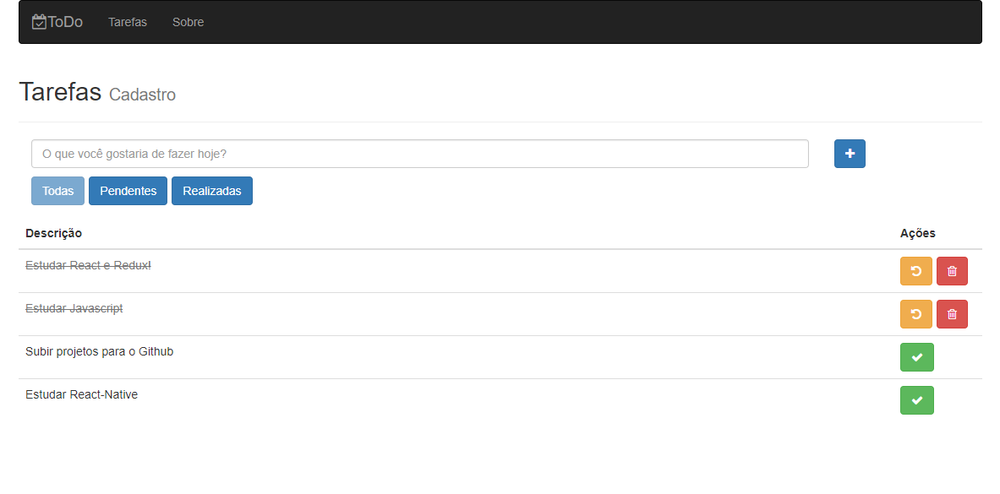
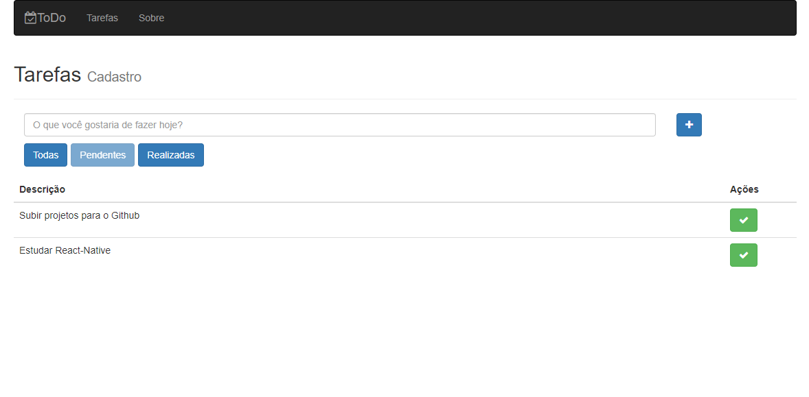
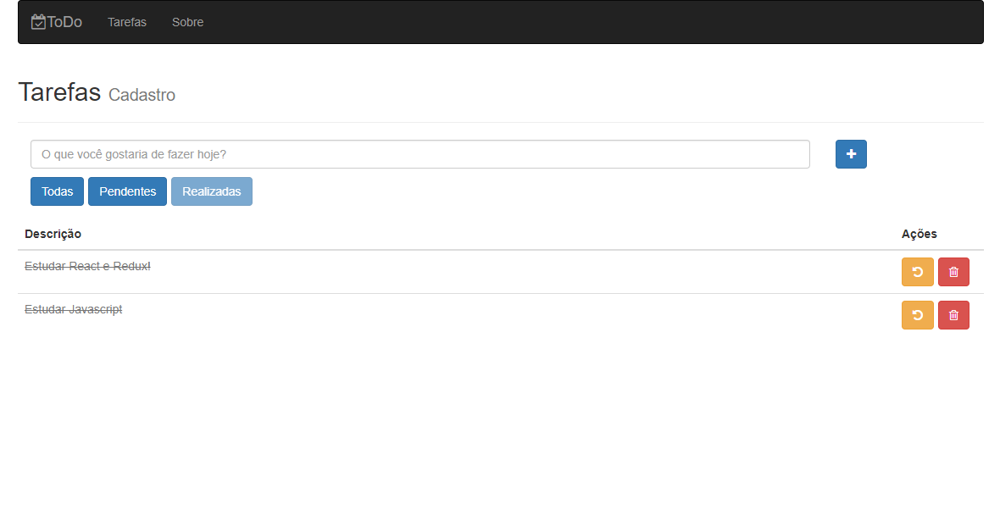

# Introdução

Esse aplicativo tem a finalidade de cadastrar e gerenciar tarefas.

# Sobre o build

O app foi criado com a utilização das seguintes ferramentas:

- Bootstrap;
- React;
- Redux;
- Webpack

# Execução

No diretória de sua escolha siga os seguintes passos:

- git clone https://github.com/LuizHonorato/todo_app.git
- npm i
- npm run dev

# Screenshots

